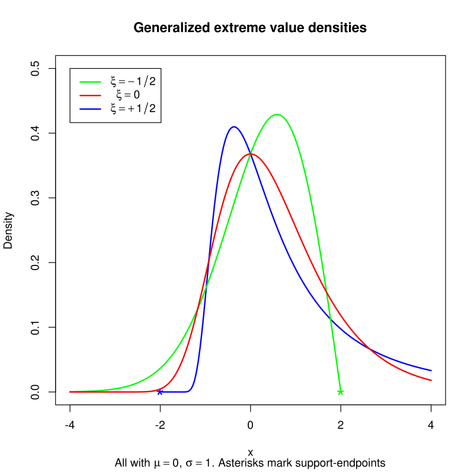

# datasciY.com
Repository for http://datasciY.com development, my coding portfolio.

### Folder Structure

 * About -- Profile
 
 * Projects -- coding projects and short coding exercises
 
 * Articles -- in depth write ups
 
 * Blog -- short posts, news and thoughts
 
 * WIP -- Work in Process
 
 All pages are hand coded by me using HTML5 and CSS3 standard.  I also hand coded the stylesheet.  After evaluating Bootstrap and W3C  Frameworks, decided to code a light weight style sheet using only items in use.  Style makes use of CSS Grid to layout photos.  Most of the coding examples are using the Python language and data science libraries.  Some of the demos and articles are about tools and cloud compute services used in doing data science.
 
 #### Author: Jennifer E Yoon  
 
 #### Tasks List as of 8/5/2019  
 
 * This week, need to focus on getting simple code examples in ML up on my website.
 
 * Also finish up links & plots in Articles.  
   * GAN, brain segmentation
   
 * Extreme Value Distributions - Weibull, Gumbel, etc.  
   * Whole distribution and only the tail portion (zoomed-in view)  
   * Link to Fréchet, Weibull and Gumbel families  
     <!-- Image, Generalized Extreme Value Distribution</a>  -->
     <!-- resize later -->
     
     Alt image insert in markdown mode
     
     
   * Sources   
     https://en.wikipedia.org/wiki/Generalized_extreme_value_distribution   
     https://www.itl.nist.gov/div898/handbook/apr/section1/apr163.htm   
