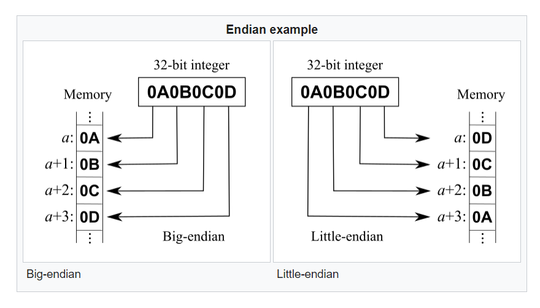

# numpy notes  

### String data type:    

 1) Inherits from Python basic data type.  
    Can create arrays of strings, np.dtype is U, unicode  
    with number for max character length. 
    Optional \> or \< for endian order byte storage.      
    ex: <U10 for 10 character max length string, small endian byte order.  
    
    'S' and 'a' are zero-terminated type-strings, alias to np.byte_. 
    Depricated, there for Python 2 compatibility.  
    For both Python 2 and 3 environment, np.unicode_ should be used for strings.  
    For python 3, use 'U' (np.unicode_) or np.str_ 

 2) Structured data type, new in numpy.  
    np.dtype is U, S, or a.  
    Discouraged S or a, which stands for 0 terminating byte.  
    So U is stil preferred, with number of char and > or <. 
    w3schools - says S is string type in Numpy. U is unicode string in Numpy.

### Other data types:  
Numpy has one character type definition (short hand).  Use inside quotes.  
 
 * 'm' (small m) - time delta (elapsed time?), in minutes?  

 * 'M' (cap m)   - datetime format  

 * 'O' (object)  - Python object, custom defined dtype, nested arrays.    

 * 'V' (void, raw) - fixed chunk of bytes memory dump, c-type, can handle any size.  
   Structured data type parent is always void type.  
   Sub-arrays in structured data type is of any field data type, numpy type.  

 * 'c' (complex float) - real and imag (imaginary) parts  

 * 'B' (unsigned byte)
 *  'b' (signed byte)  

### numpy dtype specification format:  
From numpy.org/doc/stable/reference/arrays.dtypes.html  

 1) Type of data (integer, float, complex, bool, void, object, string, etc.)  
 2) Size of data (bytes or character length)  
 3) Byte order (< or >)  
    \< Little Endian, stores least significant byte at the smallest memory address (first),  
    then move up to largest significant byte (digit).  
    \> Big Endian, usually for transmitting data, transfers most significant byte (digit) first.  
    Lilliputians who break the shell of a boiled egg from the big-end first or the small-end first.  
    Gulliver's Travels.  
    Small Endian \< seems to be default in Numpy for both numbers and strings.  
    When unspecified in dtype creation, small endian type is created.  
    
    <u><b>figure: endinans.png</b></u>  
      
    
 4) For structured array, or combination of dtypes:  
     a) names of fields  
     b) dtype of each field 
     c) which part of memory block each field takes, or length of string  
 5) For sub-arrays, dimensions or shape of arrray. Must be of fixed memory size.  
    Sub-arrays have C-contiguous memory layout.  
 
 
 ### Structured data type example, nested indexing:  
 From the doc  

  * Define custom data type 
    ```
    dt = np.dtype([('name', np.unicode_, 16), ('grades', np.float64, (2,))])
    dt['name']
    >> dtype('<U16')
    dt['grades']
    >> dtype(('<f8', (2,)))
    ```

  * Assign values, then index into custom array, nested index using two brackets.  
    ```
    x = np.array([('Sarah', (8.0, 7.0)), ('John', (6.0, 7.0))], dtype=dt)
    x[1]
    >> ('John', [6., 7.])
    x[1]['grades']
    >> array([6.,  7.])
    type(x[1])  # parent type
    >> <class 'numpy.void'>
    type(x[1]['grades'])  # sub-array type
    >> <class 'numpy.ndarray'>
    ```
 

 
 
 
