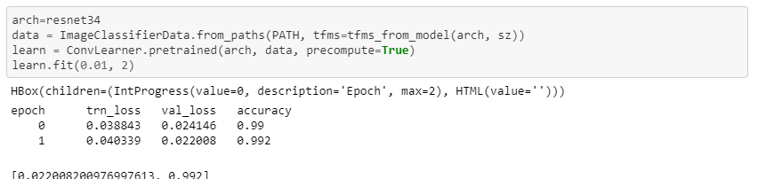
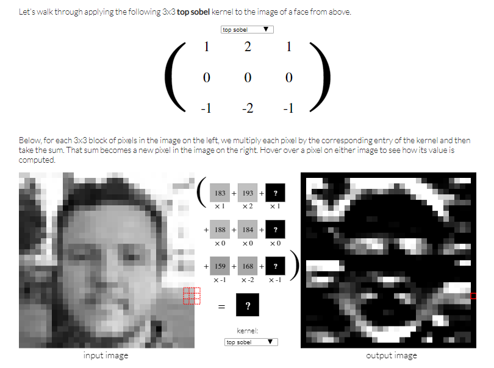

# fast.ai  deep learning part 1, 2018 version (fastai v0.7)

### Author: Jennifer Yoon  

Lecture pace is slower & easier to understand compared to 2019 version.
Doesn't use cat breeds and dog breeds categories, but just cats vs dogs.
Gets 99.9% accuracy, but is easier to understand.

Make sure to use software fastai version 0.7!  NOT fastai version 1.0, which is for 2019 class.

Class Link:  http://course18.fast.ai/
Class Wiki:  http://wiki.fast.ai/index.php/Main_Page

**Two versions: fastai/fastai/courses/dl1**  
  * "dl1-courses" has original notebooks in addition to newer versions.
  * "dl1-new" only has newer notebooks.  Does not match videos.

#### Tasks 

  * Setup Paperspace GPU -- 40 cents per hour.  Prebuilt fastai machine.
    * Periodically "git pull" fastai module, update conda3 packages.
    
  * Try notebook 1 with my own images and labels, few hundred data.
    
### Notebook 1 -- resnet34 transfer learning.  

  * Transfer Learning, from original version of Lesson1.ipynb, Dogs vs Cats.  
  
    >  
    
    ```python
    arch = resnet34 
    data = ImageClassifierData.from_paths(PATH, tfms=tfms_from_models(arch, sz))
    learn = ConvLearner.pretrained(arch, data precompute=True)          
    learn.fit(0.01, 3)
    # Learning rate is 10*e**-2.  Epochs is 3. Run through all data 3 times.
    ```
  ### Notebook 2 -- image augmentation  
    
  **Image augmentation** means create additional data for training and validation, by changing a small element randomly. Example:  zoom by small amounts, rotate by small degrees, lf-rt flip OK when it makes sense, tint & hue change by small amount.  Still a cat, but add extra images to data.  Augmented images should not affect outcome of learning.  
  
  ### Visualizing sobel filter  
  
  A really cool way to visualize a (horizontal) sobel filter.      
    
    
  
  See website [Image Kernels by Victor Powell](http://setosa.io/ev/image-kernels/)  
   - Choose "top sobel" in the drop-down box to see the horizontal sorbel filter.  
   - A Sorbel filter increases weights on the center points.  
     For example, instead of the top line being (1, 1, 1) the middle weight is increased to (1, 2, 1).

#### Tasks 8/18/2017  

 * fast.ai -- coursese2018 dp1 - Lectures watched 2.5.  
   - upload cool video on filtering, write a short blog.
    - Do several tests with different dataset.  CIFAR10 dataset?  Loaded with tensor flow?
    - AWS -- look for student free coupons.  
       - Setup fastai machine.
  * ipython notebook -- H for keyborad shortcuts.
      * Memorize more keyborad shortcuts, a few a week.
