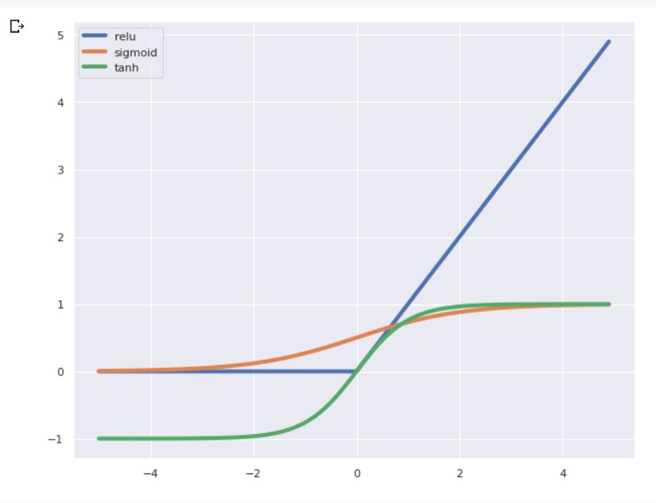

# PyTorch Deep Learning from Scratch - Wed morning.   

https://github.com/hugobowne/deep-learning-from-scratch-pytorch

### Notebook 1:  

 * alternative for "axis" keyword: df.drop(columns = ['Survived'])  
 * the points of stratify is to make sure there is the same proportion of survived and not in the test and training sets  
 
 * if stratify is none, then it will just be split by random number generator    
Can he say what stratify is again?
Jen
Tania Allard Stratify defines a split so that the values proportion in your test and train sets are the same
dhavide stratify is an option used when constructing the train-test split that ensures that both sets have the same statistics. For instance, if your set contains 30% green apples & 70% red apples, you want to ensure that the resulting train and test sets have the same distribution of red and green apples in each. That's what "stratify" means in this context.

 * @ symbol is dot product, as of python v 3.6?

 * Rules of thumb - ReLu is positive outcomes only, tanh if positive and negative outcomes, if zero to one outcome sigmoid. 
   
    [insert pytorch-plot1.jpg]
 
 
 
 
 
### Notebook 2:  
